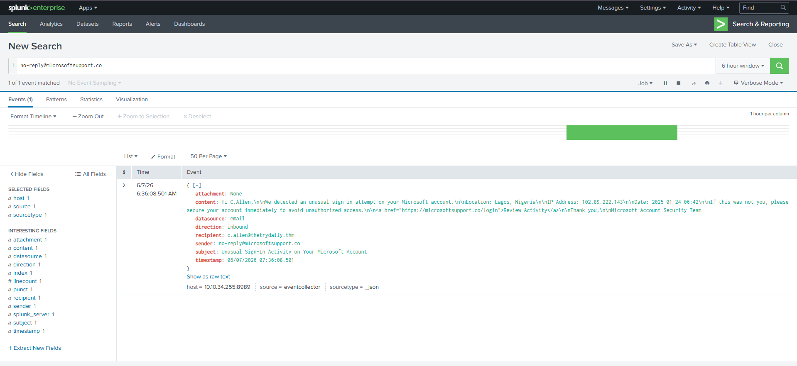
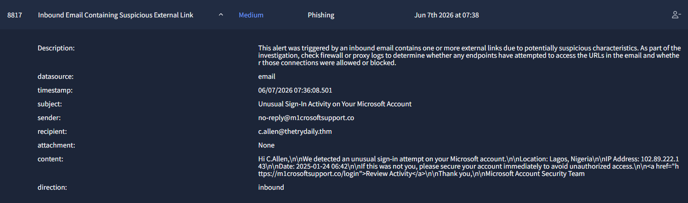

# Alert 8813: Phishing Email
### Credential Harvesting via Typosquatting

 

---

## 📋 1. Incident Details

| Artifact | Value |
| :--- | :--- |
| **Time of Activity** | `2026-06-07 07:36:08` |
| **Sender** | `no-reply@m1crosoftsupport.co` |
| **Recipient** | `c.allen@thetrydaily.thm` |
| **Subject** | Unusual Sign-In Activity on Your Microsoft Account |
| **Malicious URL** | `hxxps://m1crosoftsupport[.]co/login` |

---

## 🔍 2. Analysis & Escalation

> **Classification Verdict: TRUE POSITIVE**  
> The email uses a typosquatted domain (`m1crosoftsupport.co` substituting '1' for 'i') to masquerade as Microsoft. It leverages a fraudulent account alert to lure the user into a credential harvesting page.

* **Escalation Required?** ❌ **No.**
* **Justification:** While the email successfully bypassed gateway filters to reach the inbox, a SIEM search returned 1 of 1 matching events (email log only). No firewall or proxy logs exist, confirming the user **did not click the link**.

---

## 🎯 3. Attack Indicators

* **Domain Spoofing / Typosquatting:** Deceptive domain name (`m1` instead of `mi`) pretending to be a trusted provider.
* **Social Engineering:** Creating panic through a fake unauthorized foreign login notification to create a false sense of urgency.
* **Credential Harvesting Link:** An embedded hyperlink leading to an unverified external sign-in page.

---

## 🛡️ 4. Remediation Actions

1. **Purge:** Delete the email from the recipient's inbox immediately to prevent future interaction.
2. **Block:** Add `m1crosoftsupport.co` to the email gateway blocklist.
3. **Train:** Enroll the user in targeted security awareness training focused on identifying lookalike domains.

---

## 📸 5. Evidence

### Splunk Raw Log

### Alert Dashboard

