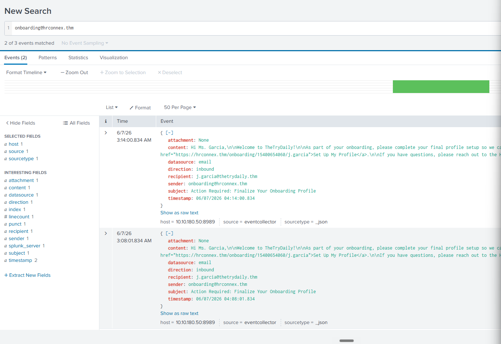
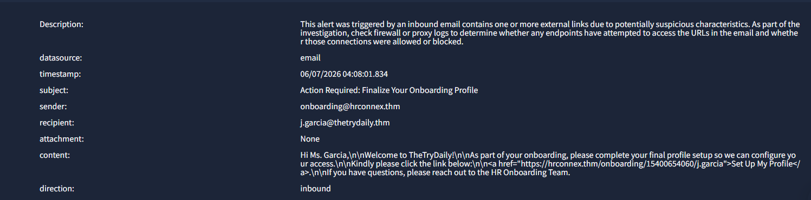

# Alert 8814: Phishing Triage
### Legitimate Vendor Onboarding Communication

 

---

## 📋 1. Incident Details

| Artifact | Value |
| :--- | :--- |
| **Time of Activity** | `2026-06-07` |
| **Sender** | `onboarding@hrconnex.thm` |
| **Recipient** | `j.garcia@thetrydaily.thm` |
| **Subject** | Finalizing Onboarding Profile |
| **Domain** | `hrconnex.thm` |

---

## 🔍 2. Analysis & Escalation

> **Classification Verdict: FALSE POSITIVE**  
> Verification against internal HR records confirmed that `hrconnex.thm` is a legitimate, company-sanctioned third-party vendor. The traffic is authorized and benign.

* **Escalation Required?** ❌ **No.**
* **Justification:** The activity is entirely consistent with standard corporate onboarding procedures and poses no security risk. 

---

## 🚦 3. Traffic Indicators

* **Legitimate Domain:** Verified external sender matching approved internal vendor lists.
* **Expected Context:** Communication directly aligns with expected scheduling and business operations for new employee onboarding.

---

## 🛡️ 4. Remediation Actions

1. **Resolve:** Mark the alert as a False Positive within the security console.
2. **Close:** Close the incident ticket with no further administrative or technical action required.

---

## 📸 5. Evidence

### Splunk Raw Log

### Alert Dashboard

