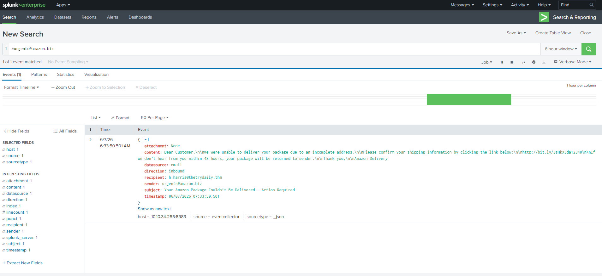
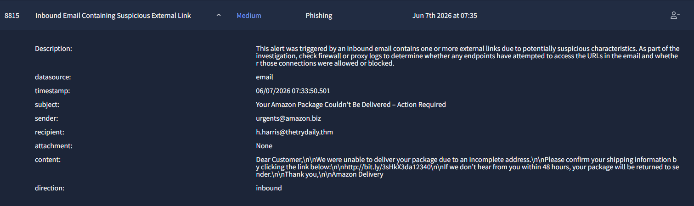

# Alert 8815: Phishing Email
### Malicious Link Obfuscation & Fake Delivery Lure

 

---

## 📋 1. Incident Details

| Artifact | Value |
| :--- | :--- |
| **Time of Activity** | `2026-06-07 07:33:50` |
| **Sender** | `urgents@amazon.biz` |
| **Recipient** | `h.harris@thetrydaily.thm` |
| **Subject** | Your Amazon Package Couldn’t Be Delivered – Action Required |
| **Malicious URL** | `hxxp://bit[.]ly/3sHkX3da12340` |

---

## 🔍 2. Analysis & Escalation

> **Classification Verdict: TRUE POSITIVE**  
> The email uses a fake domain (`@amazon.biz` instead of `.com`) and creates fake delivery urgency to manipulate the recipient. It intentionally hides the final malicious destination by utilizing a `bit.ly` URL shortener.

* **Escalation Required?** ⚠️ **Yes.**
* **Justification:** The email successfully bypassed inbound mail filters and reached the user's inbox, creating a high risk of execution. Further log analysis (firewall/proxy) may be required to verify if the user clicked the obfuscated link.

---

## 🎯 3. Attack Indicators

* **Domain Spoofing:** Deceptive external email address using a non-standard Top Level Domain (`.biz`) to impersonate a major retailer.
* **Social Engineering:** Leveraging fake delivery scare tactics to create immediate urgency and force a quick reaction from the user.
* **Obfuscation:** Masking the true malicious URL destination using a commercial link shortener to evade basic URL filtering.

---

## 🛡️ 4. Remediation Actions

1. **Purge:** Delete the email from the user's mailbox immediately to prevent accidental interaction.
2. **Block:** Add `amazon.biz` to the mail gateway blocklist.
3. **Train:** Enroll the employee in targeted phishing awareness training regarding fake urgency and link shorteners.

---

## 📸 5. Evidence

### Splunk Raw Log

### Alert Dashboard

