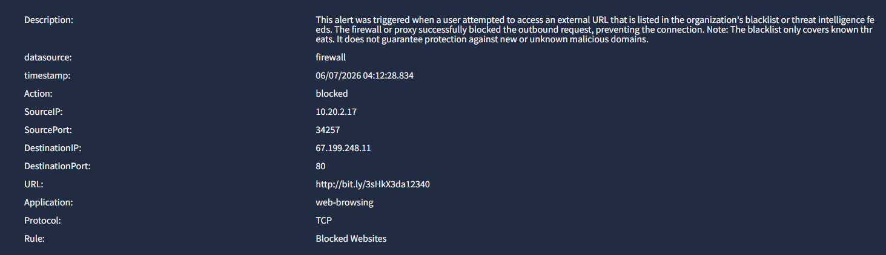

# Incident Report: Alert 8816 - Blocked Malicious Connection
**Date:** 2026-06-07 | **Status:** Closed | **Classification:** True Positive

---

## 1. Incident Details
* **Time of Activity:** 2026-06-07 14:37:00
* **Source IP:** `10.20.2.17`
* **Destination IP:** `67.199.248.11`
* **Destination Port:** `80`
* **URL:** `hxxp://bit[.]ly/3sHkX3da12340`

---

## 2. Analysis & Escalation
* **True Positive Reason:** The firewall successfully blocked an outbound connection to a blacklisted malicious domain that used a `bit.ly` link shortener.
* **Escalation Reason:** **No.** The threat was mitigated at the perimeter. A forensic scan of the endpoint logs showed 0 malicious events, confirming no compromise.

---

## 3. Attack Indicators
* **Obfuscation:** Use of a `bit.ly` shortener to hide the real destination.
* **Unauthorized Outbound Traffic:** Attempted communication with a blacklisted external IP.
* **Protocol Anomaly:** Outbound request sent over insecure Port 80 (HTTP).

---

## 4. Remediation Actions
1. **Forensics:** Scan endpoint `10.20.2.17` to check for active malware or suspicious processes.
2. **Train:** Give the user targeted phishing awareness training about shortened links.
3. **Monitor:** Keep watching the endpoint's network logs for any new outbound connections.

---

## 5. Evidence

### Splunk Raw Log

### Alert Dashboard
