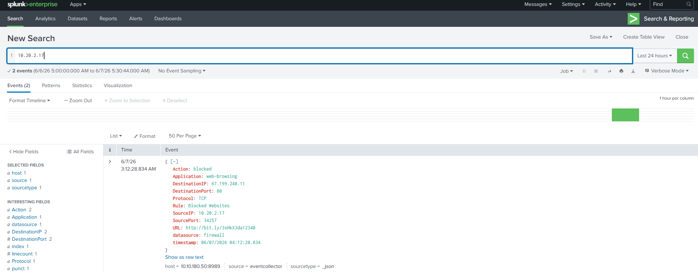

# Incident Report: Alert 8816 - Blocked Malicious Connection
**Date:** 2026-06-07 | **Status:** Resolved | **Classification:** True Positive

## 1. Description
High-severity alert triggered by a blocked outbound connection attempt from `10.20.2.17` to a blacklisted domain (`bit.ly/...`). 

## 2. Methodology
* **Tool:** Splunk Enterprise
* **Procedure:** 1. Analyzed firewall logs to confirm the destination and block status.
    2. Identified the source IP (`10.20.2.17`) and confirmed the connection was blocked by policy.
    3. Performed forensic search on the endpoint to check for post-block compromise.
* **Findings:** The connection was successfully blocked. A subsequent forensic audit of endpoint process logs yielded 0 malicious events, indicating no successful compromise.

## 3. Evidence
* **Source IP:** `10.20.2.17`
* **Destination URL:** `hxxp://bit[.]ly/3sHkX3da12340`
* **Log Evidence:**

## 4. Conclusion
**True Positive (Mitigated):** The user's device attempted a connection to a known-malicious URL, which was successfully dropped by firewall policies. No evidence of endpoint compromise found.

## 5. Remediation Actions
* **Forensics:** Scan endpoint `10.20.2.17` for malware.
* **User Education:** Targeted phishing awareness training.
* **Monitoring:** Continued monitoring for additional outbound attempts.
* **Investigation:** Deep dive into browser history to identify the link source.